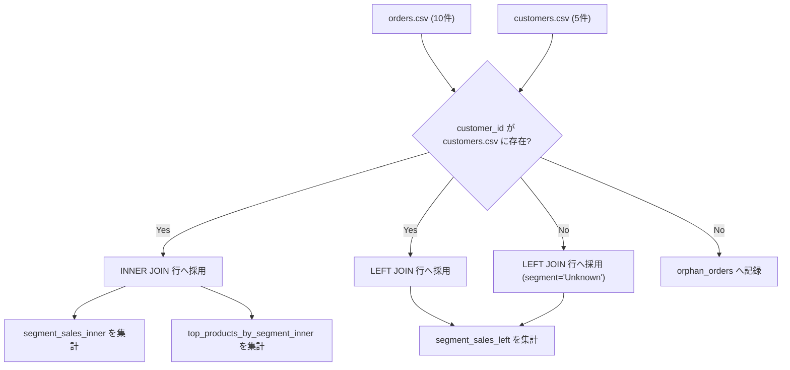

# 作業報告書

- 作成日時: 2026-02-21 18:58:37（最終更新）
- 対象プロジェクト: `python-learning`
- 報告範囲: お題3（複数データ結合 / JOIN相当）の実装・比較・検証

## 1. 実施サマリ

`customers.csv` と `orders.csv` を使い、`Python` / `Node.js` / `PHP` の3実装で同一仕様の JOIN 分析を作成した。
お題3では `INNER JOIN` と `LEFT JOIN` の両方を出力し、顧客未登録注文（orphan）の扱いまで統一した。

## 2. 追加・更新ファイル

1. 実装
- `app/data_processing/customer_order_join.py`
- `comparisons/topic3/customer_order_join_node.js`
- `comparisons/topic3/customer_order_join_php.php`

2. データ
- `data/customers_sample.csv`
- `data/orders_sample.csv`
- `data/customer_orders_expected.json`

3. ドキュメント
- `README.md`
  - お題3の実行コマンドと期待値比較手順を追記。

## 3. 共通仕様（I/F）

- 入力:
  - `--customers data/customers_sample.csv`
  - `--orders data/orders_sample.csv`
- 出力キー:
  - `summary`
  - `segment_sales_inner`
  - `segment_sales_left`
  - `top_products_by_segment_inner`
  - `orphan_orders`

### 3.1 集計ルール
- `line_total = quantity * unit_price`
- `segment_sales_inner`: INNER JOIN 後のセグメント売上
- `segment_sales_left`: LEFT JOIN 後のセグメント売上（未突合は `Unknown`）
- `top_products_by_segment_inner`: セグメント内売上トップ商品
- `orphan_orders`: 顧客マスタ未登録の注文

### 3.2 JOIN 手順の図



## 4. 行程別比較（Node.js / PHP / Python）

### 行程1: 入力読み込み（CSV）
- Node.js:
  - `fs.readFileSync` + split で行配列化。
- PHP:
  - `fgetcsv` で逐次読み込み。
- Python:
  - `pandas.read_csv()` で DataFrame 化。
- Python が得意な点:
  - 読み込み直後に列演算・JOINへ自然に接続できる。

### 行程2: JOIN（INNER / LEFT）
- Node.js:
  - 顧客マスタを `Map` 化して手動突合。
- PHP:
  - 顧客IDをキーに連想配列インデックス化して手動突合。
- Python:
  - `pandas.merge(..., how="inner")` / `how="left"` を明示。
- Python が得意な点:
  - JOIN種別やキー条件を宣言的に書けるため、仕様確認と保守がしやすい。

### 行程3: セグメント分析
- Node.js:
  - ループでセグメント別集計オブジェクトを更新。
- PHP:
  - foreach + 連想配列でセグメント別集計を更新。
- Python:
  - `groupby` + `agg` で売上・件数・平均・ユニーク顧客数を一括集計。
- Python が得意な点:
  - 集計観点（sum/count/mean/nunique）を1か所に宣言できる。

### 行程4: セグメント別トップ商品
- Node.js:
  - `segment x product` 集計後、各セグメントで手動ソートして先頭採用。
- PHP:
  - `segment x product` 集計後、`usort` でトップ採用。
- Python:
  - `groupby(["segment", "product"])` 後に `sort_values` + `drop_duplicates` で抽出。
- Python が得意な点:
  - 条件付き抽出が短く書け、集計ロジックを再利用しやすい。

### 行程5: 未突合注文（orphan）の扱い
- Node.js:
  - `Map` 突合失敗時に `orphan_orders` 配列へ追加。
- PHP:
  - 連想配列照合失敗時に `orphan_orders` へ追加。
- Python:
  - LEFT JOIN 後に `customer_name isna()` で抽出。
- Python が得意な点:
  - 欠損ベースの抽出条件を列単位で簡潔に定義できる。

## 5. 実行コマンド（Docker 経由）

1. Python
```bash
docker compose run --rm --no-deps app python -m app.data_processing.customer_order_join --customers data/customers_sample.csv --orders data/orders_sample.csv
```

2. Node.js
```bash
docker run --rm -v "$PWD":/workspace -w /workspace node:20 node comparisons/topic3/customer_order_join_node.js --customers data/customers_sample.csv --orders data/orders_sample.csv
```

3. PHP
```bash
docker run --rm -v "$PWD":/workspace -w /workspace php:8.3-cli php comparisons/topic3/customer_order_join_php.php --customers data/customers_sample.csv --orders data/orders_sample.csv
```

4. 一致検証
```bash
diff -u <(jq -S . data/customer_orders_expected.json) <(jq -S . /tmp/topic3_py.json)
diff -u <(jq -S . data/customer_orders_expected.json) <(jq -S . /tmp/topic3_node.json)
diff -u <(jq -S . data/customer_orders_expected.json) <(jq -S . /tmp/topic3_php.json)
```

## 6. 検証結果

- 3言語すべて `data/customer_orders_expected.json` と差分なし。
- `summary` の件数:
  - `customers_count`: 5
  - `orders_count`: 10
  - `inner_join_rows`: 9
  - `left_join_rows`: 10
  - `orphan_order_count`: 1

## 7. 品質チェック

- `docker compose run --rm --no-deps app ruff check app` -> `All checks passed!`
- `docker compose run --rm --no-deps app mypy app` -> `Success: no issues found in 8 source files`

## 8. お題3 完了判定

以下を満たしたため、お題3を完了とする。

1. 3言語で同一I/F・同一出力スキーマを維持した。
2. INNER JOIN / LEFT JOIN の両方を比較可能な形で実装した。
3. orphan 注文の検出と `Unknown` セグメント処理を統一した。
4. 期待値比較・lint・型チェックを通過した。

## 9. 追加対応（最終調整）

### 9.1 コメント強化

- 3実装（Python / Node.js / PHP）すべてで、以下を明示した。
  - 行程コメント（読み込み、JOIN、集計、出力）
  - Node.js / PHP / Python の比較意図
  - 返却オブジェクトの各キーの意味
  - `summary` 内各項目（件数系）の意味

### 9.2 デバッグモード追加（途中経過の可視化）

- 3実装すべてに `--debug` を追加した。
- 中間状態として以下を確認可能にした。
  - 読み込み直後の入力
  - `line_total` 計算後
  - `INNER JOIN` / `LEFT JOIN` 後
  - `orphan_orders` 抽出結果
  - セグメント集計結果
  - セグメント別トップ商品結果

#### デバッグ実行コマンド

1. Python
```bash
docker compose run --rm --no-deps app python -m app.data_processing.customer_order_join --customers data/customers_sample.csv --orders data/orders_sample.csv --debug
```

2. Node.js
```bash
docker run --rm -v "$PWD":/workspace -w /workspace node:20 node comparisons/topic3/customer_order_join_node.js --customers data/customers_sample.csv --orders data/orders_sample.csv --debug
```

3. PHP
```bash
docker run --rm -v "$PWD":/workspace -w /workspace php:8.3-cli php comparisons/topic3/customer_order_join_php.php --customers data/customers_sample.csv --orders data/orders_sample.csv --debug
```

### 9.3 デバッグ付き実行時の一致確認

- `--debug` 有効時も、最終JSONは3言語とも期待値一致を確認した。
  - `py_debug_ok`
  - `node_debug_ok`
  - `php_debug_ok`

## 10. 結論（JOIN学習観点）

本お題の結論は以下で確定する。

- Python では `pandas.merge(..., how="inner" / "left")` で JOIN 種別を明示できるため、
  Node.js / PHP の手動突合より実装意図が読み取りやすく、JOINロジックの取り違えを減らしやすい。
